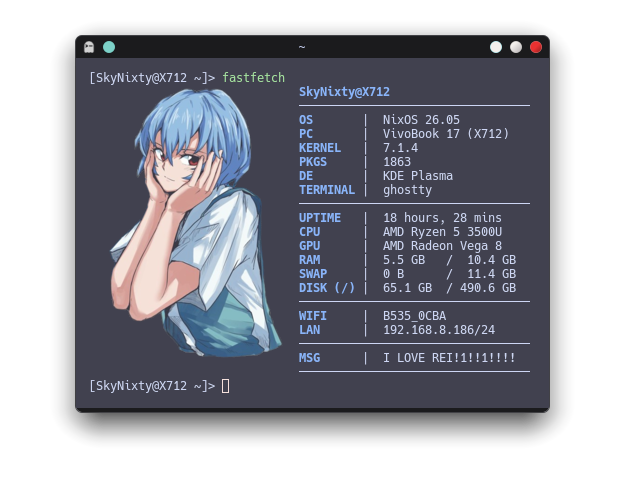

# My Rices
### Contents:
* My fastfetch
* My KDE Plasma
* My SDDM

## Artwork Disclaimer

The image used as a terminal logo (`rei.png`) is fan art of Rei Ayanami
(Neon Genesis Evangelion) and is not my own work. All rights belong to
the original artist/copyright holders.

Source: [aosora5088 on zerochan](https://www.zerochan.net/3895027)
(background of the original image is removed by me for use a terminal logo) 
 
The video used as a wallpaper is fan art of Rei Ayanami
(Neon Genesis Evangelion) and is not my own work. All rights belong to
the original artist/copyright holderso.

Source: [desktophut](https://www.desktophut.com/blue-light-anime-girl-6794)

If you're the artist and want this removed or credited differently,
please open an issue.

## Fastfetch
 

Fastfetch config is located at [config.jsonc](./fastfetch/config.jsonc)
The config has hardcoded names like (`VivoBook 17 (X712)`) and (`AMD Radeon Vega 8`) i have commented them out which will show the default fastfetch modules output, for them I'd recommend swapping them to `{name}` or `{family}`  

# License
MIT License

Copyright (c) 2026 SkyNixty

Permission is hereby granted, free of charge, to any person obtaining a copy
of this software and associated documentation files (the "Software"), to deal
in the Software without restriction, including without limitation the rights
to use, copy, modify, merge, publish, distribute, sublicense, and/or sell
copies of the Software, and to permit persons to whom the Software is
furnished to do so, subject to the following conditions:

The above copyright notice and this permission notice shall be included in all
copies or substantial portions of the Software.

THE SOFTWARE IS PROVIDED "AS IS", WITHOUT WARRANTY OF ANY KIND, EXPRESS OR
IMPLIED, INCLUDING BUT NOT LIMITED TO THE WARRANTIES OF MERCHANTABILITY,
FITNESS FOR A PARTICULAR PURPOSE AND NONINFRINGEMENT. IN NO EVENT SHALL THE
AUTHORS OR COPYRIGHT HOLDERS BE LIABLE FOR ANY CLAIM, DAMAGES OR OTHER
LIABILITY, WHETHER IN AN ACTION OF CONTRACT, TORT OR OTHERWISE, ARISING FROM,
OUT OF OR IN CONNECTION WITH THE SOFTWARE OR THE USE OR OTHER DEALINGS IN THE
SOFTWARE.
