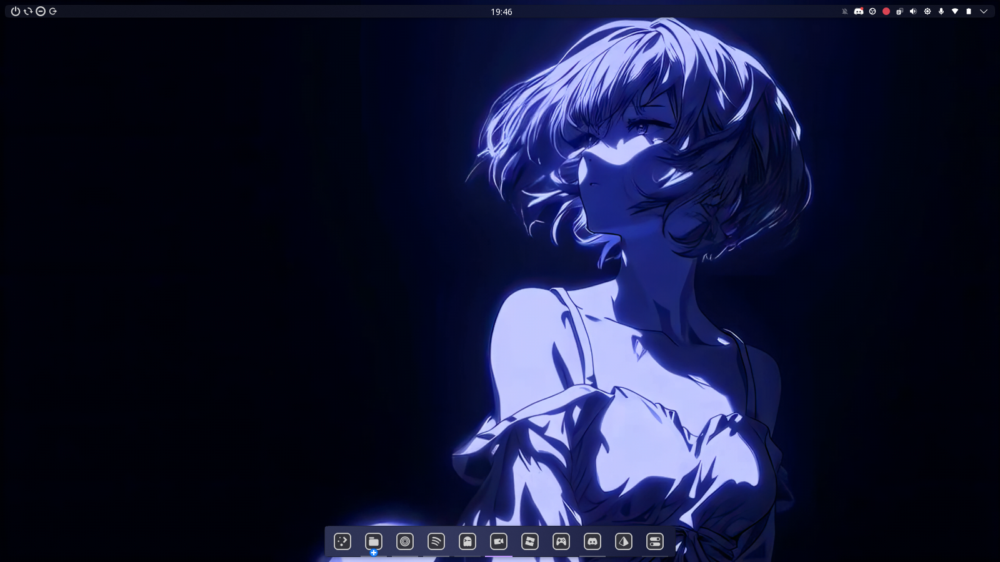
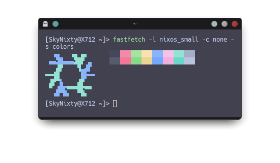

# My Rices
### Contents:
* My [fastfetch](#fastfetch)
* My [KDE Plasma](#kde-plasma)
* My [SDDM](#sddm)
* My [NixOS](#nixos) config
* My [ghostty](#ghostty) config

## Artwork Disclaimer

The image used as a terminal logo (`rei.png`) is fan art of Rei Ayanami
(Neon Genesis Evangelion) and is not my own work. All rights belong to
the original artist/copyright holders.


Source: [aosora5088 on zerochan](https://www.zerochan.net/3895027)
(background of the original image is removed by me for use a terminal logo)<br>
<br>
The video used as a wallpaper is fan art of Rei Ayanami
(Neon Genesis Evangelion) and is not my own work. All rights belong to
the original artist/copyright holders.

Source: [desktophut](https://www.desktophut.com/blue-light-anime-girl-6794)

If you're the artist and want this removed or credited differently,
please open an issue.

## Fastfetch
 

Fastfetch config is located at [config.jsonc](./fastfetch/config.jsonc)
The config has hardcoded names like (`VivoBook 17 (X712)`) and (`AMD Radeon Vega 8`) I have commented them out which will show the default fastfetch modules output, for them I'd recommend swapping them to `{name}` or `{family}`.

## KDE Plasma
### Notice: it was made on Plasma 6.6.6 and may not work on previous versions!  
### Contains:
* '[Sweet KDE](https://github.com/EliverLara/Sweet-kde)' Plasma Style
* '[Nothing](https://gitlab.com/jomada/nothing)' Window Decorations
* '[Midnight Sonata - Dark](https://github.com/SethStormR/Midnight-Sonata)' Icon Pack
* '[Bibata-Modern-Ice](https://github.com/ful1e5/Bibata_Cursor)' Cursor (size 20)
* '[Ocean](https://github.com/KDE/ocean-sound-theme)' System Sounds

### Panel and Dock settings:
#### Panel (Top): 
* Thickness 20 
* Fill
* Always Visible 
* Translucent
#### Panel items (left to right):
* Spacer (3px)
* 'Lock/Logout' Widget with Shutdown, Restart, Hibernate, Show logout screen
* Spacer (Flexible)
* Clock (24H, no date)
* Spacer (Flexible)
* 'System tray' Widget
* Spacer (3px)
#### Dock (Bottom)
* Thickness 50
* Fit Content
* Dodge Windows
* Translucent
#### Dock items (left to right):
* Application launcher 
* Icon only task manager containing (left to right):
  * Dolphin
  * Zen
  * Spotify
  * ghostty
  * OBS
  * Sober (Roblox client)
  * Steam
  * Discord
  * Prism Launcher (Minecraft launcher)
  * System settings (Not docked)

### How it looks

Wallpaper is in the art disclaimer credits

### How to add to your KDE
1. clone the repo and move it to your KDE themes folder
  Script for it:
  
```bash
git clone https://github.com/SkyNixty/SkyNixtys-Rices.git
mv 'SkyNixtys-Rices/Klean desktop environment' ~/.local/share/plasma/look-and-feel/
kbuildsycoca6 --noincremental
```
2. Enable it in Sytem Settings > Colors & Themes > Global Theme
3. If anything is missing add it manually, components are under 'Contains:'

## SDDM
### Notice: Not my own theme [SilentSDDM](https://github.com/uiriansan/SilentSDDM) by [uiriansan](https://github.com/uiriansan), wired in via [sddm.nix](./sddm.nix).
I have changed nothing of the theme, but as the repo is my system's rice I still included it.

<video src="https://github.com/user-attachments/assets/c53a7dd5-0329-4949-b3eb-c8b14a09e8b1" controls></video>

It's wired like this:
```nix
{ silentSDDM, ... }:
{
  imports = [ silentSDDM.nixosModules.default ];
  programs.silentSDDM = {
    enable = true;
    theme = "rei";
  };
}
```
You also need to copy the flake.nix part of the SDDM config so it loads on nixos-rebuild switch

## NixOS
### Notice: My  NixOS config uses flakes for SDDM
Whats in the nixos folder:
* configuration.nix
* desktop.nix
* flake.lock
* flake.nix
* hardware-configuration.nix
* other.nix
* packages.nix
* sddm.nix
* shell.nix

Make an issue if I need to change anything here or add more info

## ghostty
My terminal of choice as its easy to configure and has kitty image protocol, an image is provided above on how it looks with fastfetch, but thats in the fastfetch section, but im not gonna make you scroll back up so here it is again: <br>
 

also not my own made theme for it that is [catppuccin](https://github.com/catppuccin/ghostty?tab=readme-ov-file) mocha 

My config is at /ghostty/config <br>
[just click here to open it](./ghostty/config) 

If you dont want to manually clone it and move it there:
```bash
git clone https://github.com/SkyNixty/SkyNixtys-Rices.git
mv ~/SkyNixtys-rices/ghostty/config ~/.config/ghostty/config
echo "You successfully used one of the easiest commands you could've typed"
```


# License
MIT License

Copyright (c) 2026 SkyNixty

Permission is hereby granted, free of charge, to any person obtaining a copy
of this software and associated documentation files (the "Software"), to deal
in the Software without restriction, including without limitation the rights
to use, copy, modify, merge, publish, distribute, sublicense, and/or sell
copies of the Software, and to permit persons to whom the Software is
furnished to do so, subject to the following conditions:

The above copyright notice and this permission notice shall be included in all
copies or substantial portions of the Software.

THE SOFTWARE IS PROVIDED "AS IS", WITHOUT WARRANTY OF ANY KIND, EXPRESS OR
IMPLIED, INCLUDING BUT NOT LIMITED TO THE WARRANTIES OF MERCHANTABILITY,
FITNESS FOR A PARTICULAR PURPOSE AND NONINFRINGEMENT. IN NO EVENT SHALL THE
AUTHORS OR COPYRIGHT HOLDERS BE LIABLE FOR ANY CLAIM, DAMAGES OR OTHER
LIABILITY, WHETHER IN AN ACTION OF CONTRACT, TORT OR OTHERWISE, ARISING FROM,
OUT OF OR IN CONNECTION WITH THE SOFTWARE OR THE USE OR OTHER DEALINGS IN THE
SOFTWARE.
